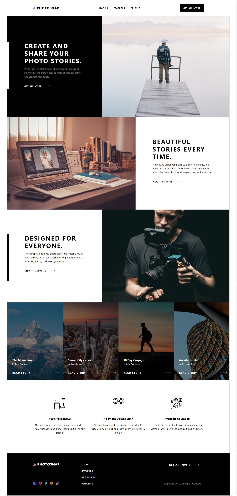
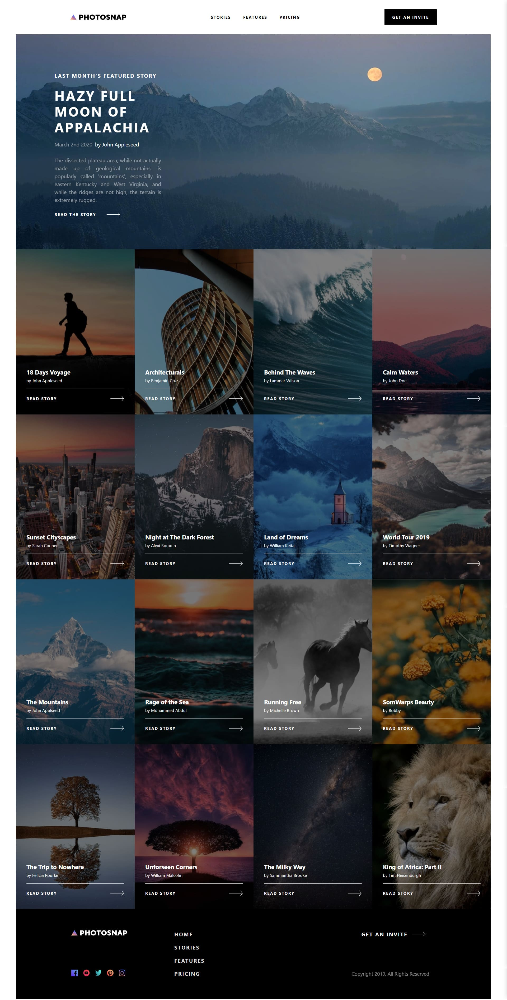
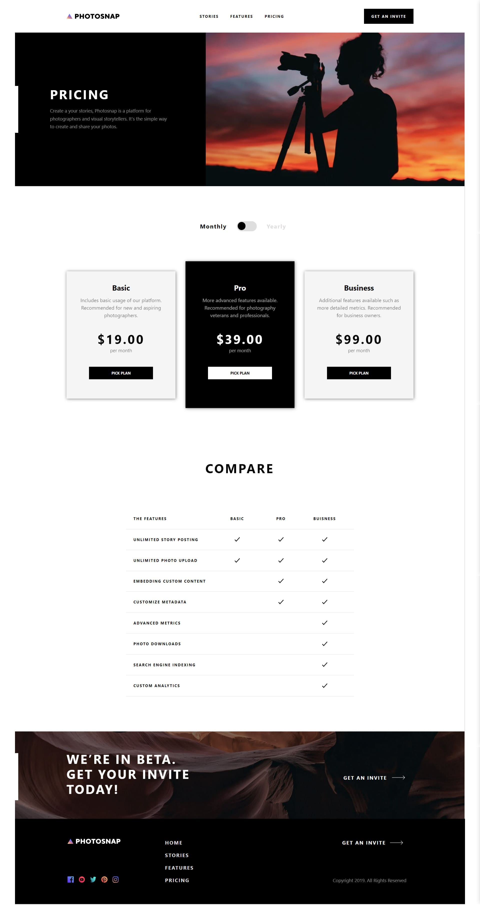

# PhotoSnap 

A multipage photo-sharing website/blog. This project was built from a Figma design with React and styled using Tailwind CSS. The build is handled by Vite and deployed on GH-Pages.

Tech: 

  

### PhotoSnap Screenshots

#### Homepage 

#### Stories 

#### Pricing

